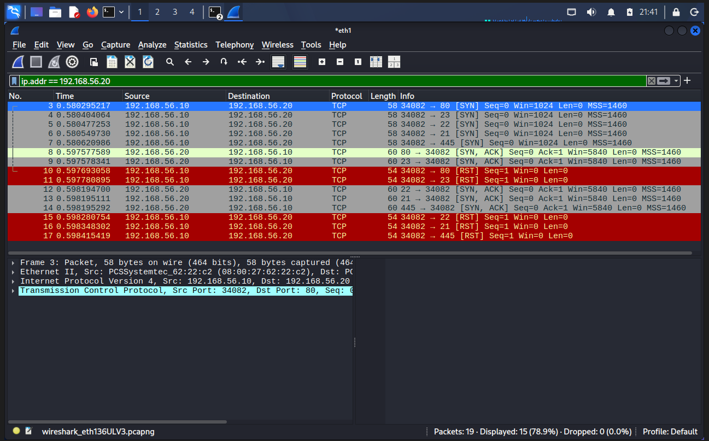

# Network Security & Reconnaissance Lab

## Overview

This project demonstrates network reconnaissance, service enumeration, and packet analysis in an isolated cybersecurity lab environment.

The lab was built using VirtualBox with Kali Linux as the analyst workstation and Metasploitable 2 as an intentionally vulnerable target system.

The objective was to identify exposed network services using Nmap and analyze TCP SYN scan behavior using Wireshark.

> **Scope:** All scanning and packet analysis in this project was performed against personally controlled virtual machines in an isolated and authorized lab environment.

---

## Lab Environment

| Component | Configuration |
|---|---|
| Hypervisor | Oracle VirtualBox |
| Analyst Machine | Kali Linux |
| Target Machine | Metasploitable 2 |
| Network Type | VirtualBox Internal Network |
| Internal Network | CyberLab |
| Kali Lab IP | 192.168.56.10/24 |
| Target IP | 192.168.56.20/24 |
| Reconnaissance Tool | Nmap |
| Packet Analysis Tool | Wireshark |

---

## Network Architecture

```text
                         Internet
                            |
                            | NAT
                            |
                      +------------+
                      | Kali Linux |
                      | Analyst VM |
                      +------------+
                      | eth0       | 10.0.2.15
                      | eth1       | 192.168.56.10
                      +-----+------+
                            |
                            | CyberLab
                            | VirtualBox Internal Network
                            |
                      +-----+------+
                      |Metasploitable|
                      |  Target VM  |
                      +------------+
                      | eth0       | 192.168.56.20
                      +------------+

                 No Internet / No Bridged Adapter
```

The vulnerable target was intentionally isolated from the physical network and Internet.

---

## Methodology

### 1. Network Configuration

A dedicated VirtualBox Internal Network named CyberLab was created to isolate lab traffic.

Static IPv4 addresses were assigned:

- Kali Linux: `192.168.56.10/24` 
- Metasploitable 2: `192.168.56.20/24`

Connectivity between the systems was verified using ICMP.

### 2. Port Discovery

An initial Nmap scan was performed against the authorized target:

```bash
nmap 192.168.56.20
```

The scan identified 23 open TCP ports among Nmap's default commonly scanned ports.

### 3. Service and Version Detection

Service enumeration was performed using:

```bash
nmap -sV 192.168.56.20
```

This provided additional information about the services listening on the discovered ports.

Selected results included:

| Port | Service | Detected Software |
|---|---|---|
| 21/TCP | FTP	| vsftpd 2.3.4 |
| 22/TCP |	SSH	| OpenSSH 4.7p1 |
| 23/TCP | Telnet	| Linux telnetd |
| 25/TCP | SMTP	| Postfix smtpd |
| 53/TCP |	DNS	| ISC BIND 9.4.2 |
| 80/TCP | HTTP	| Apache httpd 2.2.8 |
| 139/TCP |	NetBIOS/SMB |	Samba |
| 445/TCP |	SMB |	Samba |
| 3306/TCP | MySQL | MySQL 5.0.51a |
| 5432/TCP | PostgreSQL |	PostgreSQL 8.3.x |
| 5900/TCP | VNC	| VNC Protocol 3.3 |
| 8180/TCP | HTTP	| Apache Tomcat/Coyote

---

## Packet Analysis 

Wireshark was used on Kali's eth1 interface to observe traffic generated by an Nmap TCP SYN scan.

The following command generated controlled scan traffic:

```bash
nmap -sS -p 21,22,23,80,445 192.168.56.20
```

For an open TCP port, the packet capture demonstrated:

```bash
Kali                                  Target

SYN        -------------------------->
           <-------------------------- SYN/ACK
RST        -------------------------->
```

Unlike a normal TCP connection, the scanner did not complete the traditional three-way handshake. After receiving SYN/ACK from an open port, the scan terminated the probe with RST.

This demonstrated the packet-level behavior of an Nmap SYN scan.

### Wireshark Evidence

The packet capture below shows TCP SYN scan traffic between the Kali Linux analyst workstation (`192.168.56.10`) and the Metasploitable 2 target (`192.168.56.20`).



**Observed sequence:** `SYN → SYN/ACK → RST`

The capture confirms that the target responded to SYN probes on the tested open ports with SYN/ACK. Kali then sent RST packets rather than completing the normal TCP three-way handshake.

---

## Security Observations

The target exposed numerous network services, creating a large attack surface.

Several observations were made during reconnaissance:

- Numerous listening services increase the number of potential attack paths.
- Legacy protocols such as Telnet transmit traffic without modern transport encryption and should be avoided for sensitive remote administration.
- Unnecessary services should be disabled when they are not operationally required.
- Service and version identification provides information that can be used during vulnerability research.
- A detected software version alone does not prove that a vulnerability is exploitable; additional validation is required.

---

## Recommended Mitigations

Potential defensive measures include:

- Disable unnecessary network services.
- Replace insecure remote-management protocols with encrypted alternatives.
- Apply current security patches and supported software versions.
- Restrict network access using host and network firewalls.
- Segment sensitive systems from untrusted networks.
- Monitor network traffic and authentication activity.
- Conduct routine vulnerability assessments.

---

## Skills Demonstrated
- Network reconnaissance
- TCP/IP networking
- IPv4 addressing and subnetting
- Network segmentation
- Nmap port scanning
- Service enumeration
- Wireshark packet analysis
- TCP SYN/SYN-ACK/RST analysis
- Attack-surface identification
- Security documentation
- VirtualBox lab configuration

---

## Tools

Kali Linux | Nmap | Wireshark | Metasploitable 2 | Oracle VirtualBox

---

## Disclaimer

This project was performed exclusively in a personally controlled, isolated lab environment for cybersecurity education and professional development. No third-party systems were scanned or tested.
